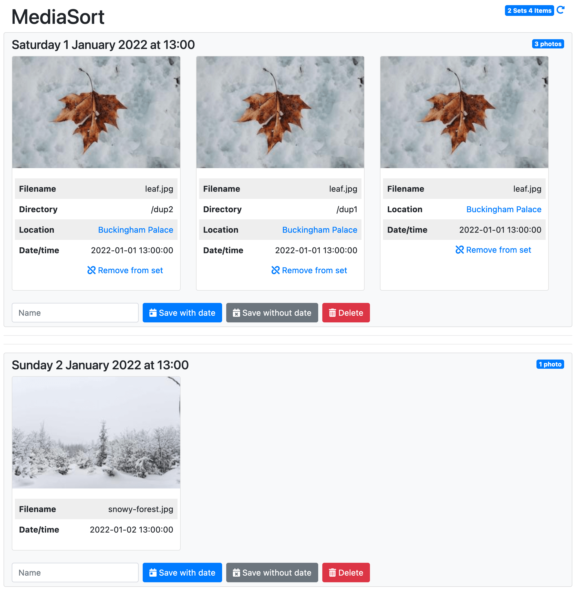

# mediasort

MediaSort is a Python3 web UI that helps you sort media items into folders. The classic use case is to take the many photos and videos produced by a smartphone, and makes sense of them. It also works well for a DSLR.

## What does it do?

The workflow is like this, assuming you keep the defaults:
* Scan the files. It will automatically places each file into a set. A set is a group of photos, seperated by 3 hours. This means that photos taken relatively close together will be in the same set.
* Each set is displayed in the UI. Each item has a location (pulled from the EXIF of the photo, and geolocated), plus the date and time.  You then decided what to do with the set.
* You can save it with date. This will create a directory in the output folder called yyyy/yyyy-mm/yyyy-mm-ddd <name>. It'll then move all the files in the set there.
* You can save it without date. This will create a directory in the output folder called <name>. It'll then move all the files in the set there.
* You can delete. This doesn't *really* delete the files in the set, but instead moves them to the deleted folder.
* Additionally, for each item in a set, you can *Remove from set*. This will detach it, and create a new set. This is useful if you want to split some sets up.
* When you give a set a name, the name is cached. This powers the typeahead.
Note that using the same name multiple times is super common. It will effectively merge a set, assuming they have the same date.

## Get it running
### Docker
The easiest way is to take the Docker Compose file, modify some of the config, and then execute it. It will start the required Redis server too.  Note that the config is very conservative by default. No folders are mapped, and it runs in "dry-run" mode by default.

    docker-compose -f docker-compose.yml up

It will then be available at port 8000 by default. If you are running it on your local machine, it is http://localhost:8000

### Configuration
See some configuration options in `default_config.py`. Override them with the `FLASK_` prefix. 

## Development, or local install

### Dependancies
Python 3, plus the modules in requirements.txt

Note you should also have exiftool installed seperately. If you do not, fewer files will be processed - and tests will fail!

The minimum version of exiftool is 12.15. If the correct version is not installed, it will fail silently. (Not sure why...)

For Ubuntu, the minimum version is in 22.04 (jammy) and later. You can download the [package](https://packages.ubuntu.com/jammy/all/libimage-exiftool-perl/download) directly and install it on earlier versions.

### How to run a development server
Assumption is a Ubuntu machine. 22.04 will "just work".

Install the dependancies (exiftool may need some help):

    pip3 install -r requirements.txt
	sudo apt install exiftool

Set the variables:

    export FLASK_REDIS_URL="redis://<ip>:<port>/0"
    export FLASK_DEBUG=true

Execute:

    python3 -m flask --app web_app run

or to have it listen across the network:

    python3 -m flask --app web_app run --host=0.0.0.0

### Configuration

If you run Flask in debug mode (via the --debug parameter or using the environment variable like above, then the `default_config_dev.py` file is used to set some parameters. Otherwise, `default_config.py` is used.

### How to test

pytest is used. Invoke:

    python3 -m pytest

Coverage (and a nice HTML report) is determined:

    python3 -m pytest --cov . --cov-branch --cov-report html

Auto-formatting is achieved using Black:

    python3 -m black .

And making sure you follow PEP 8 is done with Flake8, with the adjustments that Black recommend.

    python3 -m flake8

